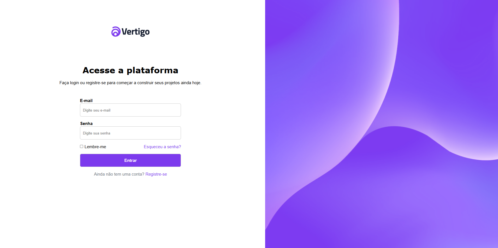

<h1> 🚀 Desafio prático - Página de Login Vertigo</h1>

  

 

## 🚀 Tecnologias

Esse projeto foi desenvolvido com as seguintes tecnologias:

- HTML e CSS
- Git e Github

## 💻 Projeto

Página web de uma página de login.
Este projeto foi realizado pelo desafio 11 #boracodar, onde fui responsável por todo o desenvolvimento, aplicando os conhecimentos adquiridos.
